# Introduction

For this phase of the project, we will explore historical appraisal data
from 2001-2021. The purpose of analysis is to evaluate percent changes
in both land and total taxable value across time and to compare growth
trajectories between cities, neighborhoods, and individual parcels. The
appraisers office maintains a historical appraisal record file (CAMA)
with valuations dating back to 2001. Not all parcels contain complete
records from 2001-2021. This is because new parcels are created from lot
splits, consolidations, etc. Therefore, if the first record date is
after 2001, this usually means that the parcel did not exist prior to
this date and was created through one of the methods listed above.

For the first phase of this analysis, we are primarily interested in
parcels that have complete records from 2001-2021 and comparing the same
parcel against itself across time. The following code was used to
retrieve, clean, analyze and visualize the data. Since we are completing
this project during the 2021 reappraisal period, we will be working with
the most recently produced historical dataset (from 2019) and adding the
2021 reappraisal values. At the time of this analysis, not all 2021
reappraisal values were made publically available (in part due to
ongoing appeals). This analysis should be re-run once the full 2021 data
has been published.

# Comparinging Individual Parcels

We select a series of individual parcels to compare. For this phase,
we’ve selected parcels that have already been featured in the
developing presentation to include in the analysis. Create a list from
the identified parcel identification numbers (PIN) to use to filter the
historical appraisal data. We’ll use the following four PINs as an
example:

  - 964902615100000 = Lordman’s
  - 964902712000000 = Minicozzi’s
  - 964762849400000 = Powell’s
  - 964671891700000 = Cecil’s

We’ll be calculating percent change in two ways. The first way calculate
the change in value from one year to the next. The second calculates the
percent change from the 2001 baseline value.

``` r
appraisal_history2019<-read.csv("D:\\Urban3\\Projects\\NC\\buncombe_co\\analyzed_data\\r_output\\Real_Estate_Appraisal_Tax_History_2019.csv", header=TRUE)
parcelsnapshot2021_table<-read.csv("D:\\Urban3\\Projects\\NC\\buncombe_co\\analyzed_data\\r_output\\parcel_snapshot_current_properties.csv", header=TRUE)

##Preparation
parcels<-c("964762849400000","964902712000000","964902615100000","964671891700000") ##Create the list of parcels used to filter the full appraisal history dataset
appraisal_history2019$totalvalue<-appraisal_history2019$LandVal+appraisal_history2019$BldgVal+appraisal_history2019$ImprVal ##Calculate total taxable value

##Organize 2019 appraisal history data frame
appraisal_history2019_abbr<-appraisal_history2019 %>%
  distinct(ï..PIN,TaxYear, .keep_all = TRUE) %>% ##The data set includes duplicated records. Remove duplicates.
  mutate(PIN=ï..PIN,
         year=TaxYear,
         landvalue=LandVal
         )%>%
  select(PIN, year, landvalue, totalvalue)%>%
  filter(PIN %in% parcels) ##Select the parcels from the list

##Organize current (2021) appraisal data frame
parcelsnapshot2021_table_abbr<-parcelsnapshot2021_table %>%
  mutate(year=2021,
         landvalue=LandValue,
         totalvalue=TaxValue)%>%
  select(PIN, year, landvalue, totalvalue)%>%
  filter(PIN %in% parcels)

appraisal_history2019_21<-rbind(appraisal_history2019_abbr,parcelsnapshot2021_table_abbr) ##Add 2021 data to the 2019 historical records

appraisal_history2019_21$totalvalue[which(appraisal_history2019_21$PIN=="964902712000000" & appraisal_history2019_21$year=="2021")]<-550800 ##Here, we add data from the 2021 data frame, that we have access to from the individual property owner's reappraisal notice
appraisal_history2019_21$landvalue[which(appraisal_history2019_21$PIN=="964902712000000" & appraisal_history2019_21$year=="2021")]<-90200 ##Here, we add data from the 2021 data frame, that we have access to from the individual property owner's reappraisal notice


##Calculate percent change
appraisal_history2019_21<-appraisal_history2019_21%>%
  group_by(PIN) %>%
  arrange(year, .by_group=TRUE) %>% ##Arrange the data according to appraisal year, this is an important step for in order to calculate percent change
  mutate(pct_change= ((totalvalue-lag(totalvalue))/lag(totalvalue)*100), ##Calculate percent change from the previous year. Here, the lag() function uses the preceding value. Important to arrange first!!
         first_totval=head(totalvalue, 1), ##Adds a new column with the 2001 total taxable value, used as the baseline for the next percent change calculation
         baselinechange=case_when(totalvalue!=first_totval~(totalvalue-first_totval)*100/first_totval, TRUE~1*NA),##Calculates percent change relative to the base year's total value
         first_landval=head(landvalue, 1),
         landbaselinechange=case_when(landvalue!=first_landval~(landvalue-first_landval)*100/first_landval, TRUE~1*NA)) 
```

#### Figure 1: Change in TOTAL Taxable Value 2001-2021 – Individual Parcel Comparisons

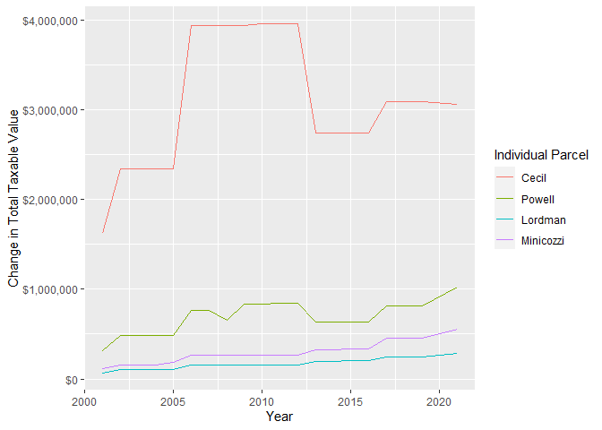<!-- -->

#### Figure 2: Percent Change in TOTAL Taxable Value from 2001 – Individual Parcel Comparisons

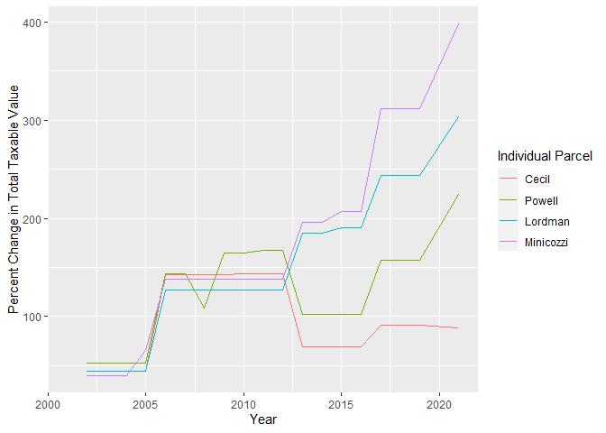<!-- -->

#### Figure 3: Percent Change in LAND Value from 2001 – Individual Parcel Comparisons

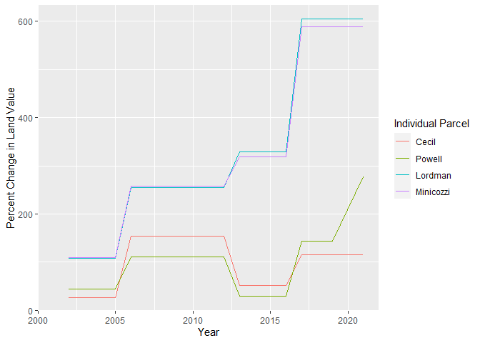<!-- -->

# Comparing growth trajectories between homes of different value

For this phase of the analysis, we group homes based on the total
taxable value in 2001 into five equally sized groups (each representing
20% of the housing stock), from low value to high value. We then compare
the average trajectories of those homes across time, to evaluate whether
there are differences in how home values change according to initial
home value. There are a few factors that could influence the
appreciation in home values across all the value brackets. Homes at any
value can be purchased, renovated, and resold at a higher price, thereby
increase the valuation. There may be greater market demand for homes
within a particular value bracket, which creates upward pressure on the
home’s value. Or the assessed value of any home could be artificially
inflated due to systematic discrepancies in the assessment process. See
the first phase of this project (J-curves) for a investigation into the
systematic assessment bias of lower valued homes.

``` r
##Organize 2019 appraisal history data frame
appraisal_history2019_full<-appraisal_history2019 %>%
  distinct(ï..PIN,TaxYear, .keep_all = TRUE) %>% ##Remove duplicates within the data frame
  mutate(PIN=ï..PIN,
         year=TaxYear,
         landvalue=LandVal)%>%
  add_count(PIN)%>% ##Add a field for the number of times the PIN appears in the data frame
  filter(n==19)%>% ##Select only those records with 19 observations per PIN (complete data from 2001-2019)
  filter(totalvalue > 0 & landvalue<(totalvalue*0.5))%>% ##Select only those records with values in 2001
  select(PIN, year, landvalue, totalvalue)

unique2019<-unique(appraisal_history2019_full$PIN) ##Create a list of unique parcel IDs, to be used in the nex step

###Organize 2021 appraisal data frame
snapshot2021_full<-parcelsnapshot2021_table %>%
  mutate(year=2021,
         landvalue=LandValue,
         totalvalue=TaxValue)%>%
  filter(PIN %in% unique2019)%>% ##Select parcels from the 2021 dataframe that are also in the 2019 dataframe
  filter(Class %in% c('100', '180'))%>% ##Select only single family residential parcels
  filter(totalvalue > 0)%>%
  select(PIN, year, landvalue, totalvalue)

appraisal_history2019_21_full<-rbind(appraisal_history2019_full,snapshot2021_full) ##Combine the 2019 and 2021 data frames

##Select complete records
appraisal_history2019_21_full_s<-appraisal_history2019_21_full%>%
  add_count(PIN)%>% ##Add count field 
  filter(n==20) ##Select only those PINs with complete records from 2001-2021

##Calculate percent change in value
appraisal_history2019_21_full_s<-appraisal_history2019_21_full_s%>%
  filter(totalvalue!=0)%>%
  group_by(PIN) %>%
  arrange(year, .by_group=TRUE) %>%
  mutate(pct_change= ((totalvalue-lag(totalvalue))/lag(totalvalue)*100), ##Calculate percent change from the previous year. Here, the lag() function uses the preceding value. Important to arrange first!!
         first_totval=head(totalvalue, 1), ##Adds a new column with the 2001 total taxable value, used as the baseline for the next percent change calculation
         baselinechange=case_when(totalvalue!=first_totval~(totalvalue-first_totval)*100/first_totval, TRUE~1*NA),##Calculates percent change relative to the base year's total value
         first_landval=head(landvalue, 1), ##Do the same for land value
         landbaselinechange=case_when(landvalue!=first_landval~(landvalue-first_landval)*100/first_landval, TRUE~1*NA))%>% 
  ungroup()%>%
  filter(year!=2001)%>% ##Percent change from 2001 will not be calculated on itself, so remove it from the data frame
  mutate(Quintile = ntile(first_totval, 5))%>% ##Calculate quintiles according to the homes original value in 2001
  group_by(Quintile, year)%>%
  summarise(mean=mean(baselinechange, na.rm=TRUE), 
            meanval=mean(totalvalue),
            meanland=mean(landbaselinechange, na.rm=TRUE))

appraisal_history2019_21_full_s$Quintile<-as.factor(appraisal_history2019_21_full_s$Quintile)
```

#### Figure 4: Change in TOTAL taxable value – comparisons across home value

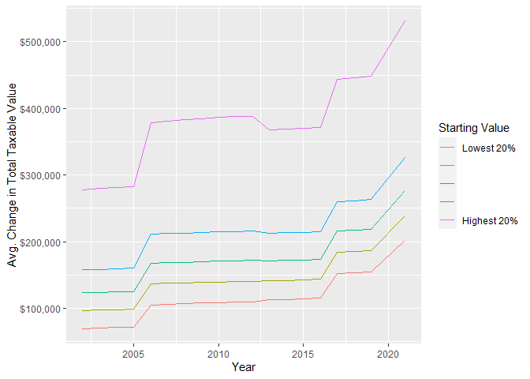<!-- -->

#### Figure 5: Percent change in TOTAL taxable value from 2001– comparisons across home value

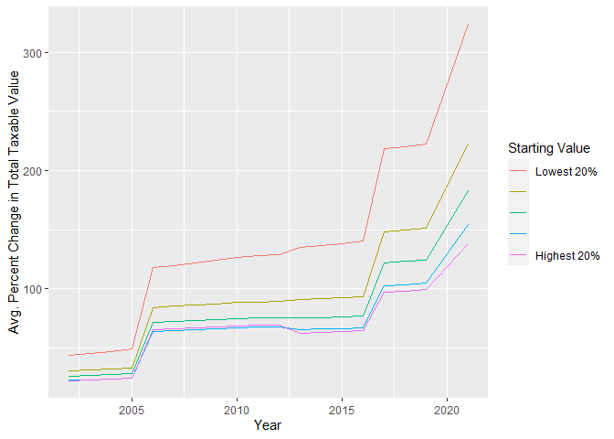<!-- -->

#### Figure 6: Percent change in LAND value from 2001– comparisons across home value

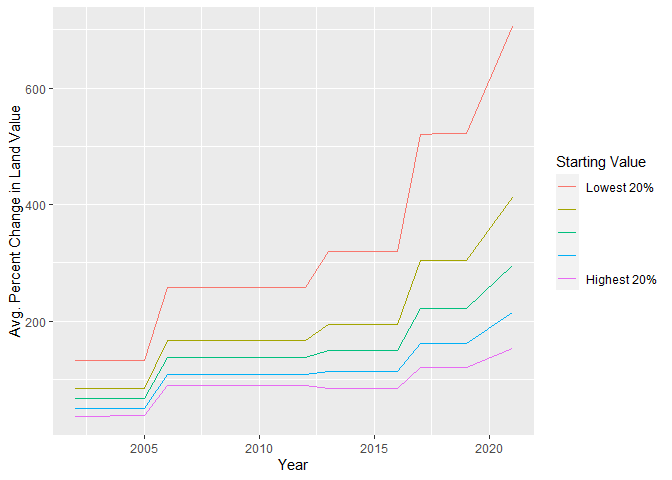<!-- -->

# Comparing growth trajectories of homes in different municipalities in Buncombe County

Here, we add a geographic crosswalk, to help identify which parcels are
associated with the various municipalities in Buncombe County. The
crosswalk was developed outside of this project, using ArcMap.

``` r
options(scipen=999)
unique2021_wneigh<-read.csv("D:\\Urban3\\Projects\\NC\\buncombe_co\\analyzed_data\\r_output\\unique2021_PIN_wNeigh.csv", header=TRUE)

##Prepare crosswalk merge field
unique2021_wneigh$PIN_join<-as.character(unique2021_wneigh$PIN_string)
unique2021_wneigh$PIN_join<-str_trim(unique2021_wneigh$PIN_join, side = c("both"))

##Prepare appraisal history merge field
appraisal_history2019_21_full$PIN_join<-str_remove(appraisal_history2019_21_full$PIN, "^0+")
appraisal_history2019_21_full$PIN_join<-str_trim(appraisal_history2019_21_full$PIN_join, side = c("both"))

##Merge geographic crosswalk to appraisal history data frame
appraisal_history2019_21_full_wneigh<-merge(appraisal_history2019_21_full, unique2021_wneigh, by="PIN_join")

##Calculate average percent change by municipality
appraisal_history2019_21_full_wneigh_s<-appraisal_history2019_21_full_wneigh%>%
  group_by(PIN_join) %>%
  arrange(year, .by_group=TRUE) %>%
  mutate(pct_change= ((totalvalue-lag(totalvalue))/lag(totalvalue)*100), ##Calculate percent change from the previous year. Here, the lag() function uses the preceding value. Important to arrange first!!
         first_totval=head(totalvalue, 1), ##Adds a new column with the 2001 total taxable value, used as the baseline for the next percent change calculation
         baselinechange=case_when(totalvalue!=first_totval~(totalvalue-first_totval)*100/first_totval, TRUE~1*NA),##Calculates percent change relative to the base year's total value
         first_landval=head(landvalue, 1), ##Do the same for land value
         landbaselinechange=case_when(landvalue!=first_landval~(landvalue-first_landval)*100/first_landval, TRUE~1*NA))%>% 
  ungroup()%>%
  filter(year!=2001)%>%
  filter(City %in% c("CAS", "CBF", "CBM", "CMT", "CWO", "CWV"))%>%
  group_by(City, year)%>%
  summarise(mean=mean(baselinechange, na.rm=TRUE),
            meanval=mean(totalvalue),
            meanland=mean(landbaselinechange, na.rm=TRUE))
```

#### Figure 7: Change in Total taxable value– comparisons between municipalities

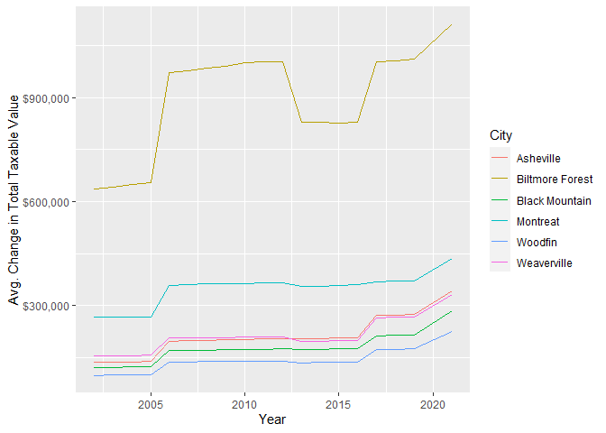<!-- -->

#### Figure 8: Percent change in TOTAL taxable value from 2001– comparisons between municipalities

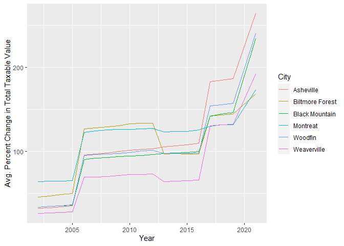<!-- -->

#### Figure 9: Percent change in LAND value from 2001– comparisons between municipalities

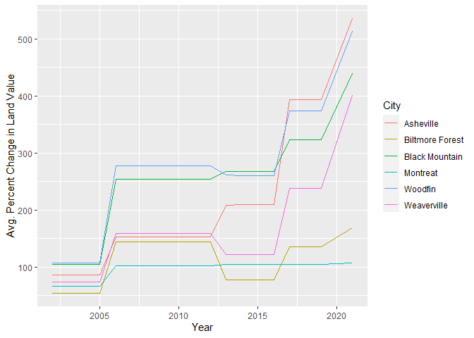<!-- -->
\# Comparing growth trajectories of homes in different neighborhoods in
Asheville

``` r
##Calculate average percent change by neighborhood
appraisal_history2019_21_full_wneigh_s<-appraisal_history2019_21_full_wneigh%>%
  group_by(PIN_join) %>%
  arrange(year, .by_group=TRUE) %>%
  mutate(pct_change= ((totalvalue-lag(totalvalue))/lag(totalvalue)*100), ##Calculate percent change from the previous year. Here, the lag() function uses the preceding value. Important to arrange first!!
         first_totval=head(totalvalue, 1), ##Adds a new column with the 2001 total taxable value, used as the baseline for the next percent change calculation
         baselinechange=case_when(totalvalue!=first_totval~(totalvalue-first_totval)*100/first_totval, TRUE~1*NA),##Calculates percent change relative to the base year's total value
         first_landval=head(landvalue, 1), ##Do the same for land value
         landbaselinechange=case_when(landvalue!=first_landval~(landvalue-first_landval)*100/first_landval, TRUE~1*NA))%>% 
  ungroup()%>%
  filter(year!=2001)%>%
  group_by(name, year)%>%
  filter(name %in% c("Burton Street", "Brucemont/Louisiana","East End/Valley Street","Shiloh","Montford","Grove Park/Sunset"))%>%
  summarise(mean=mean(baselinechange, na.rm=TRUE),
            meanval=mean(totalvalue),
            meanland=mean(landbaselinechange, na.rm=TRUE))
```

#### Figure 10: Change in Total taxable value– comparisons between neighborhoods

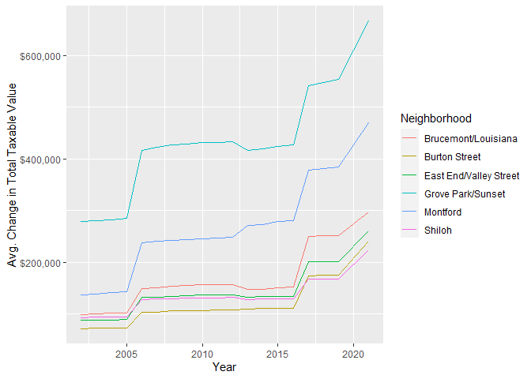<!-- -->

#### Figure 11: Percent change in TOTAL taxable value from 2001– comparisons between neighborhoods

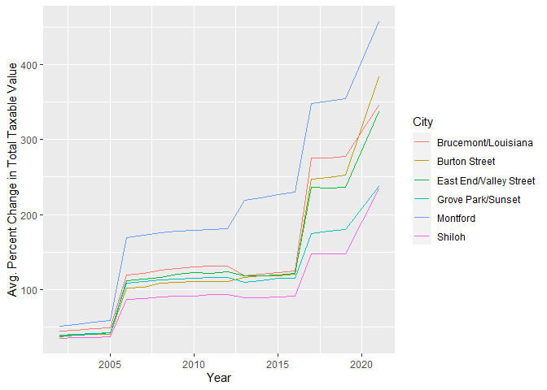<!-- -->

#### Figure 12: Percent change in LAND value from 2001– comparisons between neighborhoods

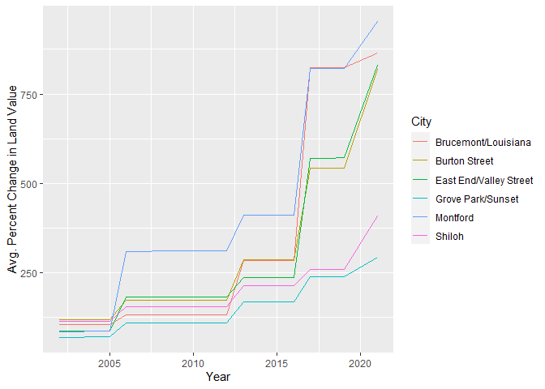<!-- -->
