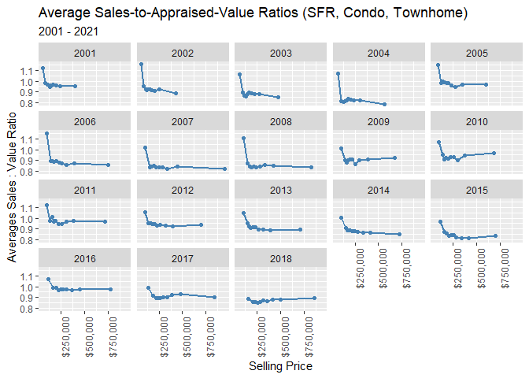

## Introduction

The following code can be used to develop historic J-curves. In this
analysis, we will merge a sales record data table with the assessment
data table. This expands on the analysis presented in ‘Buncombe
Reappraisal P1’. The data table maintains records for every sale of real
property in the County. Both qualified and unqualified transactions are
included, so we will filter out the unqualified sales. We will also use
a historic appraisal data table that includes the appraised values of
real property from 2001-2019.

We calculate sales ratios by dividing the appraised value by the selling
price. Sales ratios higher than 1 indicated situations in which the
appraised value exceeds the sale value. In truely ‘arms length’
transactions, we’d expect to see the appraised value equal to the sales
value (true market value). In this analysis we compare the sales value
to the appraised value the year following the sale date. This is to
account for situations in which improvements may have been made to the
property and increase the sales value, but have not been factored into
the appraised value until the following tax year.

``` r
appraisal_history2019$totalvalue<-appraisal_history2019$LandVal+appraisal_history2019$BldgVal+appraisal_history2019$ImprVal ##Calculate total taxable value
appraisal_history2019_abbr<-appraisal_history2019 %>%
  distinct(ï..PIN,TaxYear, .keep_all = TRUE) %>% #The data set includes duplicated records. Remove duplicates.
  mutate(PIN=ï..PIN, #recode variable names
         year=TaxYear,
         landvalue=LandVal)%>%
  select(PIN, year, landvalue, totalvalue)
appraisal_history2019_abbr$PIN_YEAR=paste(appraisal_history2019_abbr$PIN, appraisal_history2019_abbr$year, sep="_")

#Extract the year from the data field
sales_year<-as.data.frame(sapply(strsplit(sales_data_table$SellDate, "-"), `[`,1))
names(sales_year)<-c("SALES_YEAR")
sales_data_table<-cbind(sales_data_table, sales_year)
sales_data_table$PIN<-str_replace_all(sales_data_table$PINN, "-", "")
sales_data_table$SALES_YEAR<-as.numeric(sales_data_table$SALES_YEAR)

#Extract the most recent sale record
sales_data_table_year<-sales_data_table %>% 
  filter(QualifiedSale=='Y')  %>% #Select qualified sales only
  filter(SALES_YEAR>2000)%>% #Filter sales only after 2000, since we only have appraisal values back to 2001
  filter(VacantLot=="False")%>%
  filter(SellingPrice>10000)%>%
  mutate(SALES_YEAR_1=(SALES_YEAR+1))%>% #Create a new date field that allows the sales to align with the following tax year
  select(PIN, SellingPrice, City, Subdivision, Class, SALES_YEAR, SALES_YEAR_1)
sales_data_table_year$PIN_YEAR=paste(sales_data_table_year$PIN, sales_data_table_year$SALES_YEAR_1, sep="_")

sales_appraised<-merge(appraisal_history2019_abbr, sales_data_table_year, by="PIN_YEAR")
sales_appraised$sales_ratio<-sales_appraised$totalvalue/sales_appraised$SellingPrice

residential_sales_ratio<-sales_appraised%>%
  filter(Class=="RES")%>%
  group_by(SALES_YEAR)%>%
  mutate(selldecile = ntile(SellingPrice, 10))%>%
  ungroup()%>%
  group_by(selldecile, SALES_YEAR) %>%
  summarise(saleprice = mean(SellingPrice),
            sales_ratio=mean(sales_ratio),
            appraised_value=mean(totalvalue),
            count=sum(n()))
```

## Historic Sales Ratio (J-Curves) for Single Family Homes in Buncombe County

<!-- -->

## Adding Condos, Townhomes to the Analysis

``` r
residential_all_sales_ratio<-sales_appraised%>%
  filter(Class %in% c("RES","TOWNHOME","MULTIPLE R"," CONDO"))%>%
  group_by(SALES_YEAR)%>%
  mutate(selldecile = ntile(SellingPrice, 10))%>%
  ungroup()%>%
  group_by(selldecile, SALES_YEAR) %>%
  summarise(saleprice = mean(SellingPrice),
            sales_ratio = mean(sales_ratio),
            appraised_value = mean(totalvalue),
            count=sum(n()))
```

## Historic Sales Ratio (J-Curves) for Single Family Homes, Condos and Townhomes in Buncombe County

<!-- -->
